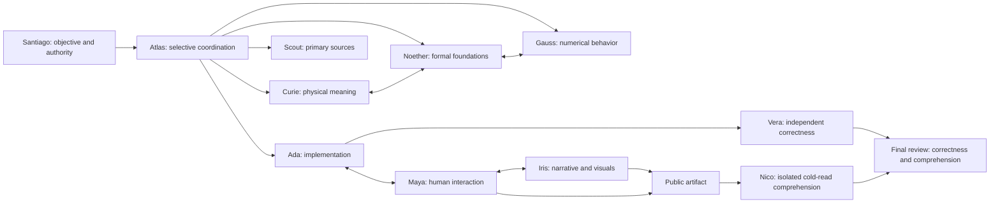

# Mathematical foundations, human factors, and reader review

The Council has ten permanent members. Existing expertise is retained: Noether bridges formal foundations with Curie's physical reasoning and Gauss's numerical evidence; Maya evaluates the complete human-system interaction alongside Ada and Iris; Nico provides an honest low-context audience perspective alongside all members.



This diagram shows complementary relationships, not a requirement to activate all members. Actual routing is selective and transparent.

## What the commands do

`assemble --agent noether` and `assemble --agent maya` use normal validated context assembly. Their identities distinguish assumptions, formal validity, physical interpretation, numerical behavior, observed usability, and implementation feasibility.

```bash
council review --agent nico --mode cold-read --artifact README.md --audience "New researcher"
council review --agent nico --mode developing-reader --artifact README.md
council review --agent nico --mode developing-reader --artifact README.md --project council-bootstrap
council evaluate comprehension --artifact README.md
council evaluate usability --artifact README.md
```

The reader commands produce an isolated JSON packet; they do not invoke a model or claim a completed review. Supply that packet alone to Nico in a fresh context. Public Markdown, text, reStructuredText, JSON, and YAML are supported up to 256 KiB. Private directories, memory paths, runtime state, environment files, traversal, and symlinks into those paths are rejected. Binary figures/slides and interactive GUI execution require a separately prepared public artifact and observed review; no automated rendering or usability study is claimed.

Both commands accept `--output` and refuse to overwrite an existing file. Evaluation status is `needs-human-review` until an explicit review report is supplied. Exit 1 without a report means candidate diagnostics were found; exit 0 means none were detected, not final acceptance. Candidate rules flag possibly undefined acronyms, dismissive assumed-understanding language, missing installation prerequisites, expected outputs, and recovery guidance. These heuristics can have false positives/negatives and cannot prove semantic understanding.

## Nico's two modes

Cold-read defaults to Nico's own identity, personality, beliefs, evaluation questions, minimal audience description, the selected artifact, and reviewed nontechnical continuity. It never loads project objectives/findings, domain memory, other specialists' answers, or previous breakthrough explanations. `--project` is rejected in this mode. Direct Nico assembly also excludes project context and domain memories.

The general dispatch snapshot is for the parent and other specialists. Nico's assignment has a separate isolated handoff. Never forward the common objective/shared_context to him. His native adapter has an empty tool allowlist and asks the parent for a packet if none is supplied. The host must enforce fresh context and tool restrictions. The CLI guarantees what it emits; it cannot sandbox a caller's model, prevent the parent from adding extra text, or erase pretrained knowledge. If host isolation is unavailable, disclose it and do not claim a genuine cold-read trial.

Developing-reader mode enables progressive tutorial learning. By default it still loads no project memories; an explicit `--project` selects only Nico's adopted memories for that project. It does not import other members' expertise or a shared project answer. Record which explanation/example enabled each conceptual breakthrough, remaining gaps, and the learning sequence. Technical learning stays in scoped memories for this mode; it must not be copied into Nico's persistent identity, beliefs, profile, or cold-read continuity.

## Relational development without domain contamination

`relationships/pairs/nico-continuity.json` starts empty. Its schema permits only participant names, qualitative relationship categories, reviewed status, evidence references, and a fixed vocabulary of nontechnical collaboration practices. Arbitrary narrative/domain fields are rejected. Only adopted, accepted, independently reviewed records with existing evidence are projected into cold-read context; evidence text and locators are not loaded into the packet.

This permits courage, patience, candid basic questions, and mature collaboration to evolve without importing technical facts. It does not certify authenticity of the reviewer or truth of an event. The general relational review process still governs authorship, interpretations, corrections, deprecation, and removal.

## Evidence-linked final gate

Create a real review JSON matching `schemas/deliverable-review.schema.json`; see the clearly illustrative template. Then run:

```bash
council evaluate comprehension --artifact README.md --review-report path/to/review.json
council evaluate usability --artifact README.md --review-report path/to/review.json
```

A final pass requires independently reviewed correctness; a nonempty, technically faithful cold-read restatement by Nico; applicable usability with implementation constraints considered; and no unresolved blocking findings. Mathematical support needs explicit assumptions. Unsupported physical or numerical validity cannot be hidden behind mathematical correctness. Developing-reader understanding alone cannot substitute for a final cold read. Passing assessments must cite existing evidence. The report must match the artifact's SHA-256 content hash; changed artifacts require refreshed review.

Metadata is not authentication or semantic proof. Qualified reviewers must actually read the evidence, test the restatement, check technical fidelity, and observe use where necessary. No automatic diagnostic can certify a theorem, empathy, accessibility, or live user comprehension. The tests check registration, data isolation, diagnostic behavior, and review gates; the scenarios specify future real agent trials.
